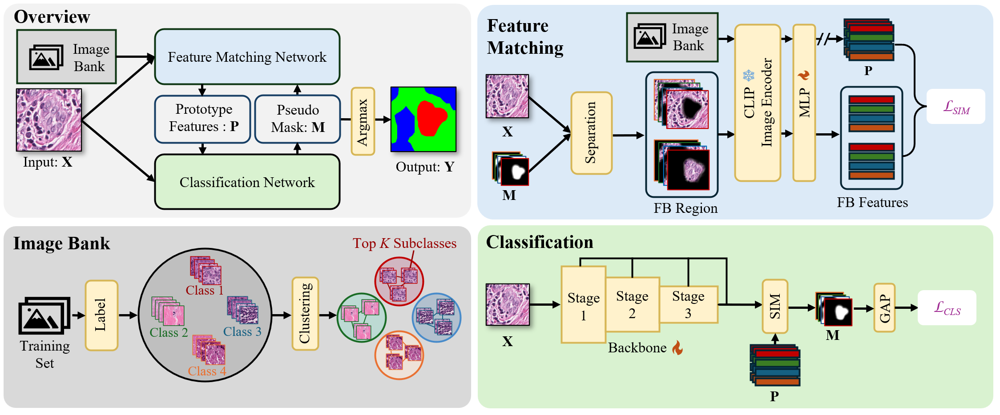

# PBIP: Prototype-Based Image Prompting for Weakly Supervised Histopathological Image Segmentation

**Official PyTorch implementation of the CVPR 2025 paper:**

> **Prototype-Based Image Prompting for Weakly Supervised Histopathological Image Segmentation**  
> *CVPR 2025*

[📄 Paper](#)

---

## 🔥 Highlights

- 🏆 **CVPR 2025** acceptance
- 🎯 **Weakly Supervised Learning**: Achieves pixel-level segmentation using only image-level labels
- 🧬 **Histopathological Focus**: Specialized for medical image analysis
- 🚀 **Prototype-Based Design**: Novel prototype-based image prompting mechanism

## 🏗️ Model Architecture

<div align="center">
  
  <p><em>Overview of the PBIP architecture for weakly supervised histopathological image segmentation</em></p>
</div>

## 🎯 Key Features

- **Multi-Scale Feature Learning**: Hierarchical feature extraction with MiT-B1 backbone
- **Prototype-Based Prompting**: Learning class-specific prototypes for image-level guidance
- **Contrastive Learning**: Foreground-background feature discrimination
- **Dynamic Thresholding**: Adaptive mask generation for better localization
- **CAM Visualization**: Generate and visualize Class Activation Maps

## 🛠️ Installation

### Requirements
- Python 3.8+
- PyTorch 1.9+
- CUDA 11.0+ (for GPU training)

### Environment Setup

#### Using requirements.txt
```bash
# Clone the repository
git clone https://github.com/your-username/PBIP.git
cd PBIP

# Create virtual environment
conda create -n pbip python=3.8
conda activate pbip

# Install exact dependencies (recommended for reproducibility)
pip install -r requirements.txt
```

### Pre-trained Models
Download the MiT-B1 backbone pretrained weights:
```bash
mkdir pretrained
# Download mit_b1.pth to pretrained/ directory
```

## 📊 Dataset

This project uses the **BCSS (Breast Cancer Semantic Segmentation)** dataset with 5 tissue classes:

| Class | Description | Color |
|-------|-------------|-------|
| TUM | Tumor | 🔴 Red |
| STR | Stroma | 🟢 Green |
| LYM | Lymphocyte | 🔵 Blue |
| NEC | Necrosis | 🟣 Purple |
| BACK | Background | ⚪ White |

### Data Structure
```
data/
├── BCSS-WSSS/
│   ├── train/
│   │   └── *.png  # Training images with class labels in filename
│   ├── test/
│   │   ├── img/   # Test images
│   │   └── mask/  # Ground truth masks
│   └── valid/
│       ├── img/   # Validation images
│       └── mask/  # Ground truth masks
```

## 🚀 Quick Start

### 1. Prepare Data
Organize your BCSS dataset according to the structure above and update paths in `work_dirs/bcss/classification/config.yaml`.

### 2. Extract Label Features
```bash
# Extract MedCLIP features for prototypes
python features/extract_medclip_proces.py
```

Training & Generate CAMs
```bash
# Train the PBIP model
python train_stage_1.py --config ./work_dirs/bcss/classification/config.yaml --gpu 0
```

```bibtex
@inproceedings{pbip2025,
  title={Prototype-Based Image Prompting for Weakly Supervised Histopathological Image Segmentation},
  author={Your Name and Co-authors},
  booktitle={Proceedings of the IEEE/CVF Conference on Computer Vision and Pattern Recognition (CVPR)},
  year={2025}
}
```

## 📜 License

This project is licensed under the MIT License - see the [LICENSE](LICENSE) file for details.

---

⭐ **Star this repo if you find it helpful!** ⭐ 